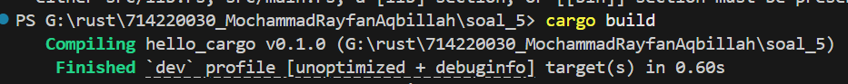
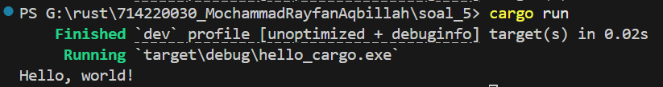

# 📦 Perbedaan `cargo build` vs `cargo run` dalam Rust

File ini menjelaskan perbedaan antara dua perintah penting dalam ekosistem Rust: `cargo build` dan `cargo run`, serta contoh penggunaannya.

---

## 🔍 Perbedaan

| Perintah     | Fungsi                                                      |
|--------------|-------------------------------------------------------------|
| `cargo build`| Menyusun (compile) program tanpa menjalankannya.            |
| `cargo run`  | Menyusun (compile) dan langsung menjalankan program.        |

---

cargo build
Output:

➡️ Program tidak dijalankan secara otomatis.

cargo run

➡️ Program akan disusun jika ada perubahan, lalu langsung dijalankan.